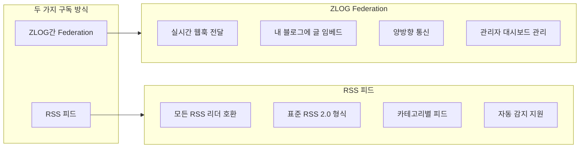
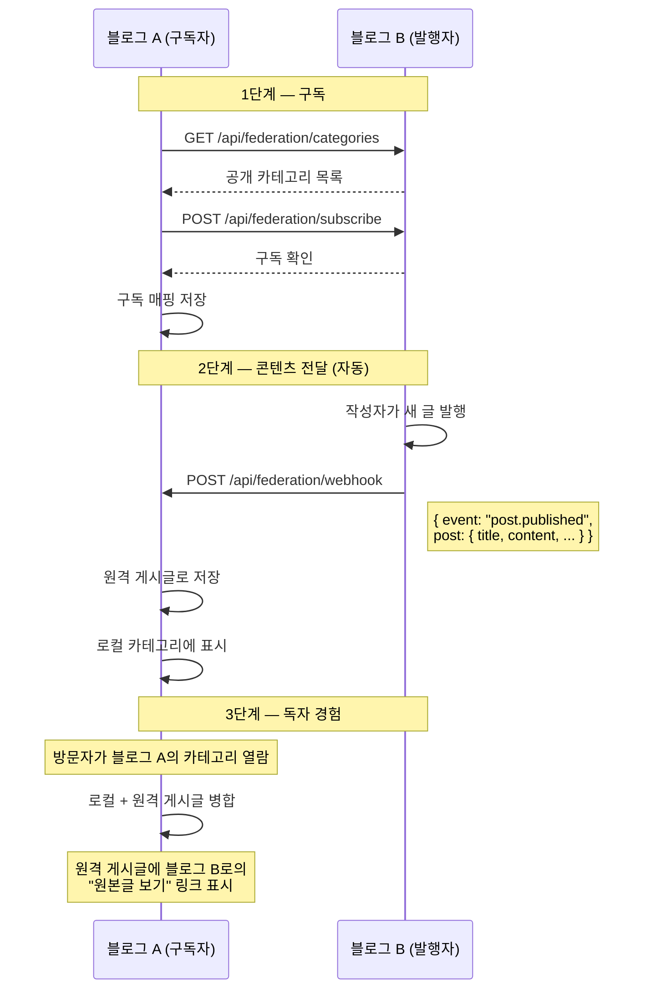
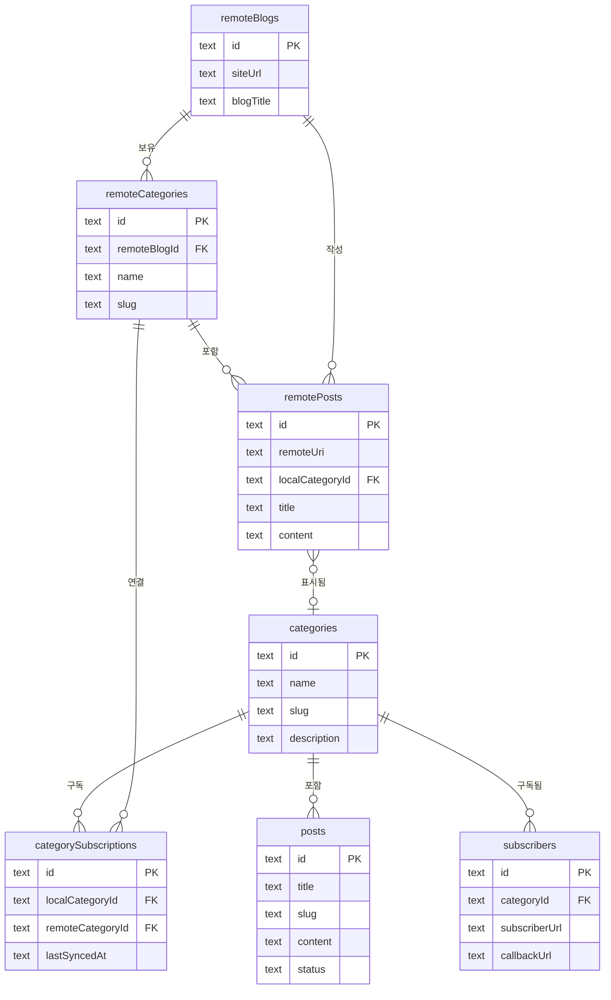
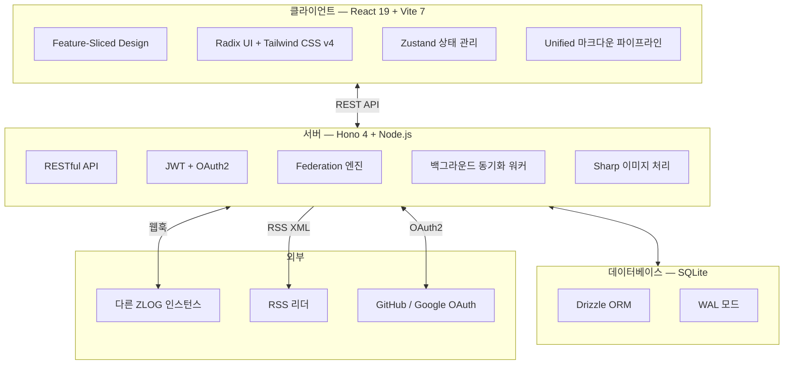

 <br />

## 🌐 zlog: 독립적이면서도 연결된, 분산형 커뮤니티 블로그

**"나의 데이터 주권은 지키면서, 커뮤니티의 연결성은 누리세요."**

zlog는 **"관심사가 비슷한 친구들이나 동호회원들이 각자 블로그를 운영하면서, 서로의 글을 구독해 하나의 거대한 피드를 함께 구성해 보면 어떨까?"** 하는 즐거운 상상에서 시작되었습니다.


### 🤝 나만의 공간, 우리의 피드

- **함께 만드는 네트워크**: 개인이 블로깅을 하되, 서로의 카테고리를 연결하여 관심사가 같은 동료들의 글을 내 블로그에서 모아볼 수 있습니다.
- **연결을 통한 발견**: 내 글이 아닌 다른 사람의 글을 통해서도 새로운 zlogger를 발견하고 방문할 수 있는, 흐르는 형태의 커뮤니티를 지향합니다.
- **취향의 구독**: 나의 카테고리가 마음에 드는 다른 zlogger는 해당 카테고리를 구독해 자신의 블로그 피드에 실시간으로 통합할 수 있습니다.

> "각자의 섬이 모여 하나의 대륙이 되는 것, 그것이 zlog가 꿈꾸는 분산형 블로그 네트워크의 모습입니다."

[English](./README.md)

<p>
  
  
  
  
  
  
  
</p>

---

## 왜 ZLOG인가?

|                        | 중앙형 플랫폼        | 정적 사이트 생성기   | **ZLOG**                |
| ---------------------- | -------------------- | -------------------- | ----------------------- |
| **데이터 소유권**      | 플랫폼이 데이터 소유 | 파일은 내 것         | **모든 것이 내 것**     |
| **블로그 간 구독**     | 플랫폼 종속          | 미지원               | **Federation 내장**     |
| **RSS**                | 때때로 지원          | 플러그인 필요        | **네이티브 지원**       |
| **댓글**               | 서드파티 필요        | 서드파티 필요        | **내장 (SSO + 익명)**   |
| **설치 난이도**        | 없음                 | 빌드 파이프라인 필요 | **`docker compose up`** |
| **라즈베리 파이 지원** | 해당 없음            | 가능                 | **네이티브 지원**       |

### 문제: 외딴 섬이 되어버린 독립 블로그

개인 블로그는 종종 **'외딴 섬'**이 됩니다. 아무리 좋은 글을 써도 다른 이들과 소통하려면 거대 플랫폼(네이버, 티스토리 등)의 생태계 안으로 스스로 들어가거나, RSS 리더나 SNS 같은 외부 도구에 의존해야만 합니다.

거대 플랫폼은 연결을 쉽게 해주지만 나의 데이터 주권과 디자인의 자유를 가져가고, 독립 블로그는 자유롭지만 고립되기 쉽습니다. **"나만의 공간을 유지하면서도, 소중한 사람들과 느슨하고 즐겁게 연결될 수는 없을까?"** 이것이 우리가 마주한 고민이었습니다.

### 해결책: 블로그, 커뮤니티의 노드가 되다

ZLOG는 블로그 자체에 **구독과 연합(Federation) 기능을 내장**하여, 각자의 독립성을 유지하면서도 하나의 거대한 커뮤니티 피드를 함께 만들어가는 **'분산형 커뮤니티 네트워크'**를 제안합니다.

1. **함께 만드는 커뮤니티 피드**: 관심사가 비슷한 친구나 동호회원들이 각자 자신의 블로그를 운영하되, 서로의 카테고리를 구독하면 내 블로그가 곧 우리만의 소셜 대시보드가 됩니다.
2. **연결을 통한 상생과 발견**: 내 글과 구독한 동료의 글이 하나의 피드에서 어우러집니다. 방문자는 내 블로그에서 자연스럽게 내가 좋아하는 다른 블로그를 발견하고 여행할 수 있습니다.
3. **데이터 주권과 디자인의 자유**: 이 모든 연결이 일어나는 동안 데이터는 오직 나의 서버(맥미니, 라즈베리 파이 등)에 안전하게 보관됩니다. 플랫폼의 제약 없이 내가 원하는 디자인으로 커뮤니티를 시각화하세요.

블로그마다 독립적이면서도 서로 연결되는 **분산 블로그 네트워크**, 그것이 ZLOG입니다.

---

## 핵심 기능: 구독 & Federation

ZLOG를 특별하게 만드는 기능입니다. ZLOG 블로그를 구독하는 **두 가지 방법**이 있습니다:



### ZLOG간 Federation

두 ZLOG 인스턴스가 연결되면 자동 콘텐츠 전달이 포함된 **실시간 구독**이 형성됩니다.



#### 동작 방식

1. **구독**: 관리자 대시보드에서 원격 블로그 URL을 입력하고, 구독할 카테고리를 선택한 뒤, 로컬 카테고리에 매핑합니다. 구독 요청은 서버 간 통신으로 전송됩니다 (CORS 문제 없음).

2. **자동 전달**: 발행자가 새 글을 작성하면, ZLOG가 모든 구독자에게 웹훅을 보냅니다. 게시글 내용(이미지 URL 포함)이 로컬에 저장됩니다.

3. **통합 표시**: 원격 게시글이 로컬 게시글과 함께 카테고리 목록에 날짜순으로 표시됩니다. 각 원격 게시글에는 원본 블로그로의 "원본글 보기" 링크가 있습니다. 원격 게시글은 홈페이지의 "전체" 탭에도 표시됩니다.

4. **백그라운드 동기화**: 백그라운드 워커가 주기적으로 모든 구독을 자동 동기화합니다 (기본: 15분 간격, `WEBHOOK_SYNC_INTERVAL`로 설정 가능). 웹훅이 실패하더라도 게시글이 누락되지 않도록 보장합니다. 워커는 효율성을 위해 증분 동기화(`?since=lastSyncedAt`)를 사용합니다.

5. **수동 동기화**: 관리자 대시보드에서 언제든지 수동 동기화를 트리거하여 최신 게시글을 즉시 가져올 수 있습니다.

### RSS 피드

모든 ZLOG 블로그는 RSS 2.0 피드를 자동으로 생성합니다:

| 피드            | URL                        | 설명                             |
| --------------- | -------------------------- | -------------------------------- |
| **전체 블로그** | `/rss.xml`                 | 모든 카테고리의 최신 20개 게시글 |
| **카테고리별**  | `/category/{slug}/rss.xml` | 특정 카테고리의 최신 20개 게시글 |

- **자동 감지**: HTML head에 `<link rel="alternate">` 태그로 RSS 리더가 자동 감지
- **표준 형식**: Feedly, Inoreader, NetNewsWire 등 모든 RSS 2.0 리더와 호환
- **RSS 링크**가 사이드바와 각 카테고리 페이지에 표시

### 관리자 구독 관리

관리자 대시보드에서 완전한 구독 관리 인터페이스를 제공합니다:

- **내 구독**: 구독 중인 모든 카테고리 확인, 마지막 동기화 시간 표시
- **구독 추가**: 원격 블로그 URL 입력 → 카테고리 조회 → 선택 & 로컬 카테고리에 매핑
- **수동 동기화**: 원클릭 동기화 버튼으로 최신 게시글 가져오기
- **자동 동기화**: 백그라운드 워커가 모든 구독을 자동으로 동기화 (설정 가능한 주기)
- **구독 해제**: 더 이상 원하지 않는 구독 제거
- **구독자 목록**: 내 카테고리를 구독 중인 외부 블로그 확인

### 데이터 아키텍처



---

## 전체 기능 한눈에 보기

### 글쓰기 & 편집

- **마크다운 에디터** + 실시간 미리보기 (편집 / 분할 / 미리보기 모드)
- **이미지 붙여넣기 & 드래그 앤 드롭** — 자동 업로드 및 삽입
- **커버 이미지** 업로드 지원
- **커스텀 임베드**: YouTube, CodePen, CodeSandbox
- **코드 블록**: 구문 강조 (highlight.js) + 자동 포맷팅 (Prettier)
- **언어 라벨 & 복사 버튼** (코드 블록)
- **Mermaid 다이어그램** 렌더링 + 클릭 확대
- **초안 / 발행** 워크플로우 + 관리자 게시글 관리

### 댓글

- **설정 가능한 모드**: SSO 전용, 전체 허용 (SSO + 익명), 익명 전용, 비활성화
- **OAuth 로그인**: GitHub, Google을 통한 인증 댓글
- **익명 댓글**: 비밀번호로 수정/삭제 가능
- **관리자 중재**: 확인 후 모든 댓글 삭제 가능
- **XSS 방지**: 텍스트만 허용, 서버 측 정제

### 외관

- **라이트 / 다크 테마** 전환 + 시스템 설정 감지
- **헤더 & 푸터 커스터마이징**: 배경색, 배경 이미지, 높이 조절
- **반응형 디자인**: 모바일 최적화 + 스크롤 시 헤더 자동 축소
- **글래스모피즘** 효과 (헤더/푸터)

### 다국어 지원

- **영어** (기본) 및 **한국어** 내장
- **관리자 설정 가능**: 설정에서 언어 변경
- 날짜, 시간 경과 포맷 포함 모든 UI 문자열 번역

### SEO & 검색 최적화

- **RSS 피드** (블로그 전체 및 카테고리별)
- **sitemap.xml** 자동 생성
- **robots.txt** 설정
- **Open Graph & Twitter Card** 메타 태그
- **SEO 설정** (관리자에서 설명, OG 이미지 설정)

### 방문자 분석

- **실시간 대시보드**: 오늘의 순 방문자 수와 총 페이지 뷰를 실시간으로 확인합니다.
- **상세 로그**: IP, 국가, OS, 브라우저, 유입 경로(Referer)를 포함한 최근 방문자 기록을 제공합니다.
- **Federation 조회수 추적**: 다른 블로그가 내 글을 구독해서 읽을 때, 독자의 프라이버시를 안전하게 보호하면서도 조회수를 수집합니다.
- **프라이버시 중심**: 모든 데이터는 로컬에만 저장되며, 외부 트래커를 사용하지 않습니다.

### 알림 (Notifications)

- **Slack 연동**: Slack 웹훅을 통해 실시간 알림을 수신합니다.
- **댓글 알림**: 내 게시글에 새로운 댓글이나 답글이 달릴 때 알려줍니다.
- **Federation 알림**: 외부 블로그가 내 카테고리를 구독할 때 즉시 알려줍니다.
- **다국어 지원**: 블로그 기본 언어 설정(한/영)에 맞춰 알림 메시지가 자동으로 적용됩니다.

### 기술

- **PWA**: 설치 가능, 서비스 워커로 오프라인 지원
- **이미지 최적화**: Sharp 기반 리사이즈/압축 → WebP 변환
- **SQLite**: 설정 불필요, 단일 파일 백업
- **JWT 인증**: 관리자용
- **RESTful API**: Hono 프레임워크
- **백그라운드 동기화 워커**: 주기적 Federation 자동 동기화 + GC 최적화
- **서버 프록시 Federation**: 모든 크로스 오리진 호출이 서버 간 통신 (CORS 의존성 없음)

---

## 시스템 아키텍처



---

## 빠른 시작

### Docker 사용 (권장)

```bash
# 저장소 클론
git clone https://github.com/zebra0303/zlog.git
cd zlog

# 환경 설정
cp .env.example .env
# .env를 편집하여 설정 (관리자 이메일, 비밀번호, 사이트 URL)

# Docker Compose로 시작
docker compose up -d

# http://localhost:3000 에서 블로그 접속
```

### Docker + HTTPS (프로덕션)

```bash
# 도메인 설정 후 Caddy 리버스 프록시와 함께 시작
DOMAIN=yourblog.com docker compose --profile production up -d

# Caddy가 자동으로 SSL 인증서를 발급합니다
# https://yourblog.com 에서 접속
```

### 수동 설치

```bash
# 의존성 설치
npm install

# 개발 모드 (핫 리로드)
npm run dev

# 프로덕션 빌드
npm run build
npm run start
```

### 라즈베리 파이

ZLOG는 리소스가 제한된 기기에서도 동작하도록 설계되었습니다:

```bash
# 라즈베리 파이 3/4/5에서 동작
docker compose up -d

# 또는 수동 빌드 (메모리 최적화 빌드 스크립트 포함)
npm install
npm run build
npm run start
```

---

## 환경 변수

| 변수                    | 설명                        | 기본값                  |
| ----------------------- | --------------------------- | ----------------------- |
| `PORT`                  | 서버 포트                   | `3000`                  |
| `SITE_URL`              | 블로그 공개 URL             | `http://localhost:3000` |
| `ADMIN_EMAIL`           | 관리자 로그인 이메일        | `admin@example.com`     |
| `ADMIN_PASSWORD`        | 관리자 로그인 비밀번호      | `changeme`              |
| `ADMIN_DISPLAY_NAME`    | 작성자 표시 이름            | `Blog Owner`            |
| `JWT_SECRET`            | JWT 서명 비밀키             | `please-change-this`    |
| `WEBHOOK_SYNC_INTERVAL` | Federation 동기화 주기 (분) | `15`                    |
| `GITHUB_CLIENT_ID`      | GitHub OAuth App Client ID  | —                       |
| `GITHUB_CLIENT_SECRET`  | GitHub OAuth App Secret     | —                       |
| `GOOGLE_CLIENT_ID`      | Google OAuth Client ID      | —                       |
| `GOOGLE_CLIENT_SECRET`  | Google OAuth Client Secret  | —                       |

---

## 프로젝트 구조

```
zlog/
├── client/           # 프론트엔드 (FSD 아키텍처)
│   └── src/
│       ├── app/      # 엔트리포인트, 라우터, 프로바이더
│       ├── pages/    # 페이지 컴포넌트
│       ├── widgets/  # 헤더, 푸터, 사이드바
│       ├── features/ # 인증, 댓글, 테마
│       ├── entities/ # PostCard, CategoryBadge
│       └── shared/   # UI 컴포넌트, API 클라이언트, i18n, 유틸리티
├── server/           # 백엔드 (Hono)
│   └── src/
│       ├── __tests__/ # API 통합 테스트 (Vitest)
│       ├── db/       # 스키마, 마이그레이션
│       ├── routes/   # API 라우트
│       ├── middleware/# 인증, 에러 핸들러
│       ├── services/ # 비즈니스 로직
│       └── lib/      # 유틸리티
├── shared/           # 공유 타입
├── Dockerfile
├── docker-compose.yml
└── Caddyfile
```

---

## Federation 프로토콜 요약

ZLOG의 Federation과 통합하려는 개발자를 위한 안내:

### 공개 엔드포인트 (인증 불필요)

| 메서드 | 엔드포인트                             | 설명                           |
| ------ | -------------------------------------- | ------------------------------ |
| `GET`  | `/api/federation/info`                 | 블로그 메타데이터              |
| `GET`  | `/api/federation/categories`           | 공개 카테고리                  |
| `GET`  | `/api/federation/categories/:id/posts` | 카테고리의 게시글              |
| `GET`  | `/api/federation/posts/:id`            | 단일 게시글 상세 (실시간 검증) |
| `POST` | `/api/federation/subscribe`            | 카테고리 구독                  |
| `POST` | `/api/federation/unsubscribe`          | 구독 해제                      |
| `POST` | `/api/federation/webhook`              | 콘텐츠 업데이트 수신           |

### 웹훅 페이로드

```json
{
  "event": "post.published",
  "post": {
    "id": "019c...",
    "title": "Hello World",
    "slug": "hello-world",
    "content": "# Hello\n\nThis is my first post.",
    "excerpt": "This is my first post.",
    "coverImage": "/uploads/cover.webp",
    "status": "published",
    "createdAt": "2026-02-14T00:00:00.000Z",
    "updatedAt": "2026-02-14T00:00:00.000Z"
  },
  "categoryId": "019c...",
  "siteUrl": "https://publisher-blog.com"
}
```

### 웹훅 이벤트

| 이벤트             | 트리거                       |
| ------------------ | ---------------------------- |
| `post.published`   | 새 글 발행 또는 초안 → 발행  |
| `post.updated`     | 발행된 글 내용 수정          |
| `post.deleted`     | 게시글 삭제 또는 발행 → 초안 |
| `post.unpublished` | 게시글 상태가 발행에서 변경  |

---

## 링크

- **라이브 데모**: [http://zlog.pe.kr](http://zlog.pe.kr)
- **GitHub**: [https://github.com/zebra0303/zlog](https://github.com/zebra0303/zlog)
- **라이선스**: MIT

---

<p align="center">
  <strong>ZLOG</strong> — 내가 관심 있는 세상의 모든 이야기, 내 블로그에서.
</p>
