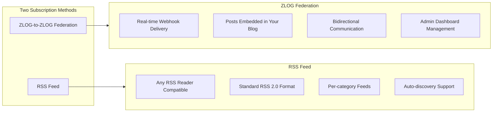
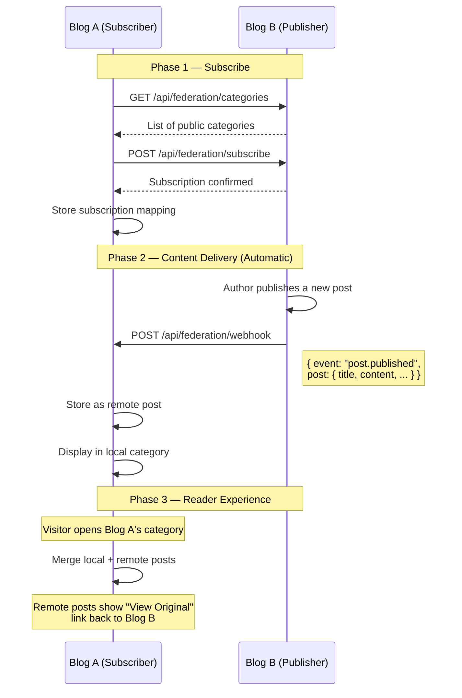
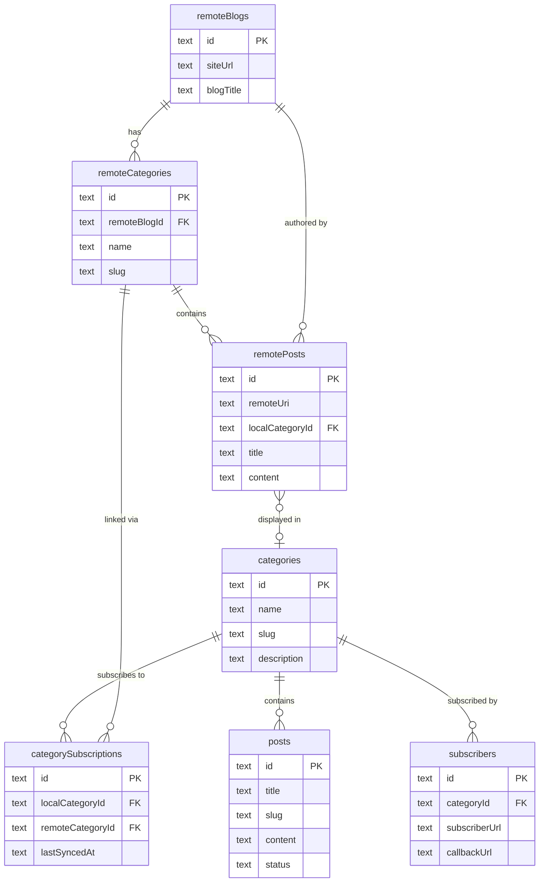
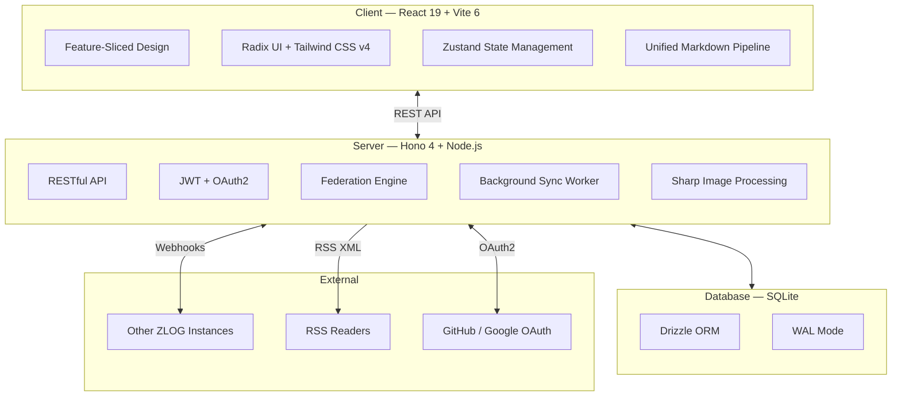

 <br />

## 🌐 zlog: A Decentralized Community Network Beyond Personal Blogging

**"Maintain full data ownership while enjoying seamless community connectivity."**

zlog began with a simple, exciting vision: **"What if friends or hobbyist groups with shared interests could run their own blogs while subscribing to each other to build a collective feed together?"**

### 🤝 Personal Space, Shared Community

- **Co-created Networks**: While each person runs their own blog, you can connect specific categories to aggregate posts from like-minded peers right on your own dashboard.
- **Discovery through Flow**: Discover new zloggers through shared posts on your blog, and let your own content travel to others' feeds, inviting new audiences to your space.
- **Subscribe to Tastes**: If another zlogger loves your category, they can subscribe to it and integrate your latest updates into their own blog in real-time.

> "Where individual islands come together to form a continent—this is the decentralized blog network zlog envisions."

[한국어 문서 (Korean)](./README.ko.md)

<p>
  
  
  
  
  
  
  
</p>

---

## Why ZLOG?

|                             | Centralized Platforms   | Static Site Generators | **ZLOG**                       |
| --------------------------- | ----------------------- | ---------------------- | ------------------------------ |
| **Data Ownership**          | Platform owns your data | You own files          | **You own everything**         |
| **Cross-blog Subscription** | Platform-dependent      | Not built-in           | **Built-in Federation**        |
| **RSS**                     | Sometimes               | Plugin needed          | **Native support**             |
| **Comments**                | Third-party required    | Third-party required   | **Built-in (SSO + Anonymous)** |
| **Setup Complexity**        | None                    | Build pipeline needed  | **`docker compose up`**        |
| **Runs on Raspberry Pi**    | N/A                     | Possible               | **Yes, natively**              |

### The Problem: Personal Blogs as Isolated Islands

Personal blogs often become **"isolated islands."** No matter how great your content is, staying connected with peers or building a community usually requires moving into a "walled garden" (like Medium or Tumblr) or relying heavily on external tools like RSS readers and social media.

Centralized platforms offer connectivity at the cost of your data sovereignty and design freedom, while independent blogs offer freedom but suffer from isolation. **"Is it possible to maintain my own space while staying effortlessly connected with the people I care about?"** This is the question ZLOG aims to answer.

### The Solution: Your Blog, a Community Node

ZLOG transforms your blog into a **community node** by building subscription and federation right into the core engine. It creates a **"decentralized community network"** where independence and connectivity coexist.

1. **Co-created Community Feeds**: Friends or hobbyist groups can run their own independent blogs. By subscribing to each other's categories, your blog becomes a shared social dashboard for your circle.
2. **Discovery through Flow**: Your posts and subscribed posts from your peers live together in a single, unified feed. Visitors to your blog can naturally discover and jump to other amazing zloggers you follow.
3. **Sovereignty Meets Connectivity**: All these interactions happen on your own hardware (Mac Mini, Raspberry Pi, etc.). You maintain 100% ownership of your data and design while enjoying the benefits of a connected network.

Independent yet interconnected — a **decentralized blog network**. That's ZLOG.

---

## Core Feature: Subscription & Federation

This is what makes ZLOG unique. There are **two ways** to subscribe to a ZLOG blog:



### ZLOG-to-ZLOG Federation

When two ZLOG instances connect, they form a **live subscription** with automatic content delivery.



#### How It Works

1. **Subscribe**: From your admin dashboard, enter a remote blog URL, select a category to follow, and map it to one of your local categories. The subscription request is sent server-to-server (no CORS issues).

2. **Automatic Delivery**: When the publisher writes a new post, ZLOG sends a webhook to all subscribers. The post content (with properly resolved image URLs) is stored locally.

3. **Seamless Display**: Remote posts appear in your category listings alongside your own posts, sorted by date. Each remote post shows a "View Original" link to the source blog. Remote posts also appear in the "All" tab on the homepage.

4. **Background Sync**: A background worker automatically syncs all subscriptions periodically (default: every 15 minutes, configurable via `WEBHOOK_SYNC_INTERVAL`). This ensures no posts are missed even if webhooks fail. The worker uses incremental sync (`?since=lastSyncedAt`) for efficiency.

5. **Manual Sync**: You can also trigger a manual sync from the admin dashboard at any time to immediately fetch the latest posts.

### RSS Feed

Every ZLOG blog automatically generates RSS 2.0 feeds:

| Feed             | URL                        | Description                            |
| ---------------- | -------------------------- | -------------------------------------- |
| **Full Blog**    | `/rss.xml`                 | Latest 20 posts across all categories  |
| **Per Category** | `/category/{slug}/rss.xml` | Latest 20 posts in a specific category |

- **Auto-discovery**: `<link rel="alternate">` tag in HTML head for automatic detection by RSS readers
- **Standard format**: Compatible with Feedly, Inoreader, NetNewsWire, and any RSS 2.0 reader
- **RSS links** are visible in the sidebar and on each category page

### Admin Subscription Management

The admin dashboard provides a complete subscription management interface:

- **My Subscriptions**: View all categories you're subscribed to, with last sync time
- **Add Subscription**: Enter a remote blog URL → fetch categories → select & map to local category
- **Manual Sync**: One-click sync button to fetch latest posts from a subscription
- **Auto Sync**: Background worker syncs all subscriptions automatically (configurable interval)
- **Unsubscribe**: Remove subscriptions you no longer want
- **Subscriber List**: See which external blogs are subscribed to your categories

### Data Architecture



---

## All Features at a Glance

### Writing & Editing

- **Markdown Editor** with live preview (edit / split / preview modes)
- **Image paste & drag-and-drop** — automatically uploaded and inserted
- **Cover image** support with upload
- **Custom embeds**: YouTube, CodePen, CodeSandbox
- **Code blocks** with syntax highlighting (highlight.js) and auto-formatting (Prettier)
- **Language label & copy button** on code blocks
- **Mermaid diagram** rendering with click-to-zoom
- **Draft / Publish** workflow with post management in admin

### Comments

- **Configurable modes**: SSO Only, Allow All (SSO + Anonymous), Anonymous Only, Disabled
- **OAuth login**: GitHub and Google for authenticated commenting
- **Anonymous comments** with password for edit/delete
- **Admin moderation**: delete any comment with confirmation
- **XSS protection**: plain text only, server-side sanitization

### Appearance

- **Light / Dark theme** toggle with system preference detection
- **Custom header & footer**: background color, background image, adjustable height
- **Responsive design**: mobile-optimized with auto-shrinking header on scroll
- **Glassmorphism** effects on header/footer

### Internationalization

- **English** (default) and **Korean** built-in
- **Admin configurable**: change language from settings
- All UI strings translated including dates, time-ago formatting

### SEO & Discovery

- **RSS feeds** (blog-wide and per-category)
- **Sitemap.xml** auto-generated
- **robots.txt** configured
- **Open Graph & Twitter Card** meta tags
- **SEO settings** in admin (description, OG image)

### Technical

- **PWA**: installable, offline-capable with service worker
- **Image optimization**: Sharp-based resize/compress to WebP
- **SQLite**: zero-config database, single file backup
- **JWT authentication** for admin
- **RESTful API** with Hono framework
- **Background sync worker**: automatic periodic federation sync with GC optimization
- **Server-proxied federation**: all cross-origin calls are server-to-server (no CORS dependency)

---

## System Architecture



---

## Quick Start

### With Docker (Recommended)

```bash
# Clone the repository
git clone https://github.com/zebra0303/zlog.git
cd zlog

# Configure environment
cp .env.example .env
# Edit .env with your settings (admin email, password, site URL)

# Start with Docker Compose
docker compose up -d

# Access your blog at http://localhost:3000
```

### With Docker + HTTPS (Production)

```bash
# Set your domain and start with Caddy reverse proxy
DOMAIN=yourblog.com docker compose --profile production up -d

# Caddy automatically obtains SSL certificates
# Access at https://yourblog.com
```

### Manual Setup

```bash
# Install dependencies
npm install --legacy-peer-deps

# Development (hot reload)
npm run dev

# Production build
npm run build
npm run start
```

### On Raspberry Pi

ZLOG is designed to run on resource-constrained devices:

```bash
# Works on Raspberry Pi 3/4/5
docker compose up -d

# Or build manually (memory-optimized build script included)
npm install --legacy-peer-deps
npm run build
npm run start
```

---

## Environment Variables

| Variable               | Description                | Default                 |
| ---------------------- | -------------------------- | ----------------------- |
| `ADMIN_EMAIL`          | Admin login email          | `admin@example.com`     |
| `ADMIN_PASSWORD`       | Admin login password       | `admin1234`             |
| `SITE_URL`             | Public URL of your blog    | `http://localhost:3000` |
| `BLOG_TITLE`           | Blog title                 | `My Blog`               |
| `BLOG_HANDLE`          | Unique blog handle         | `admin`                 |
| `DISPLAY_NAME`         | Author display name        | `Blog Owner`            |
| `JWT_SECRET`           | Secret for JWT signing     | `change-me-...`         |
| `PORT`                 | Server port                | `3000`                  |
| `GITHUB_CLIENT_ID`     | GitHub OAuth App Client ID | —                       |
| `GITHUB_CLIENT_SECRET` | GitHub OAuth App Secret    | —                       |
| `GOOGLE_CLIENT_ID`     | Google OAuth Client ID     | —                       |
| `GOOGLE_CLIENT_SECRET` | Google OAuth Client Secret | —                       |

---

## Project Structure

```
zlog/
├── client/           # Frontend (FSD Architecture)
│   └── src/
│       ├── app/      # Entry point, router, providers
│       ├── pages/    # Page components
│       ├── widgets/  # Header, footer, sidebar
│       ├── features/ # Auth, comments, theme
│       ├── entities/ # PostCard, CategoryBadge
│       └── shared/   # UI components, API client, i18n, utilities
├── server/           # Backend (Hono)
│   └── src/
│       ├── db/       # Schema, migrations
│       ├── routes/   # API routes
│       ├── middleware/# Auth, error handlers
│       ├── services/ # Business logic
│       └── lib/      # Utilities
├── shared/           # Shared types
├── Dockerfile
├── docker-compose.yml
└── Caddyfile
```

---

## Federation Protocol Summary

For developers who want to integrate with ZLOG's federation:

### Public Endpoints (No Auth Required)

| Method | Endpoint                               | Description                            |
| ------ | -------------------------------------- | -------------------------------------- |
| `GET`  | `/api/federation/info`                 | Blog metadata                          |
| `GET`  | `/api/federation/categories`           | Public categories                      |
| `GET`  | `/api/federation/categories/:id/posts` | Posts in a category                    |
| `GET`  | `/api/federation/posts/:id`            | Single post detail (live verification) |
| `POST` | `/api/federation/subscribe`            | Subscribe to a category                |
| `POST` | `/api/federation/unsubscribe`          | Unsubscribe                            |
| `POST` | `/api/federation/webhook`              | Receive content updates                |

### Webhook Payload

```json
{
  "event": "post.published",
  "post": {
    "id": "019c...",
    "title": "Hello World",
    "slug": "hello-world",
    "content": "# Hello\n\nThis is my first post.",
    "excerpt": "This is my first post.",
    "coverImage": "/uploads/cover.webp",
    "status": "published",
    "createdAt": "2026-02-14T00:00:00.000Z",
    "updatedAt": "2026-02-14T00:00:00.000Z"
  },
  "categoryId": "019c...",
  "siteUrl": "https://publisher-blog.com"
}
```

### Webhook Events

| Event              | Trigger                                 |
| ------------------ | --------------------------------------- |
| `post.published`   | New post published or draft → published |
| `post.updated`     | Published post content updated          |
| `post.deleted`     | Post deleted or published → draft       |
| `post.unpublished` | Post status changed from published      |

---

## Links

- **Live Demo**: [http://zlog.pe.kr](http://zlog.pe.kr)
- **GitHub**: [https://github.com/zebra0303/zlog](https://github.com/zebra0303/zlog)
- **License**: MIT

---

<p align="center">
  <strong>ZLOG</strong> — Every story you care about, right on your blog.
</p>
